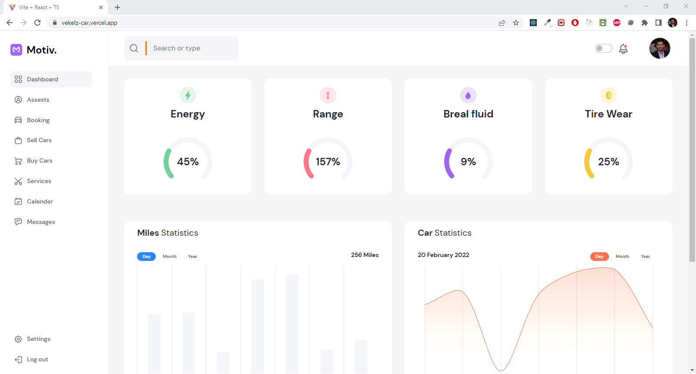
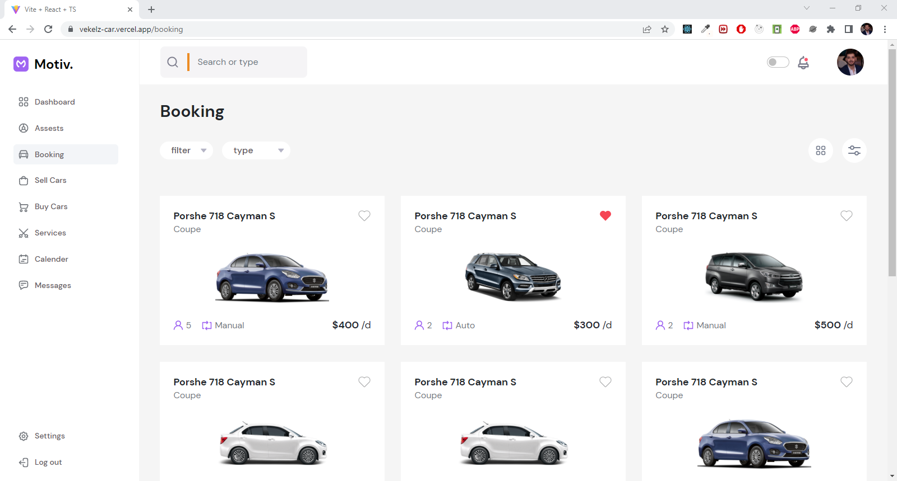
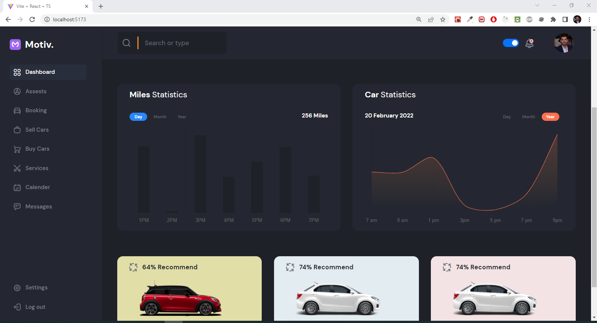
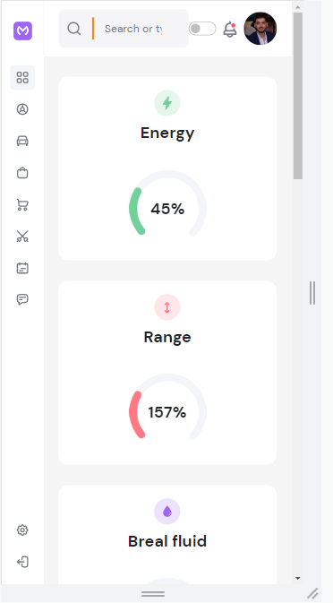

## vekelz-car

## Usage

by

- installing app's dependency
  ```shell
    npm install
  ```
- start dev server by using
  ```shell
    npm run dev
  ```

## Features

- (Home Page, Bookin Page)
- Interactive chart using chart.js
- Full responsive web app
- dark mode

## Dashboard Imaegs

- some images






## Preview

- https://vekelz-car.vercel.app/
- https://rad-bombolone-680157.netlify.app/
